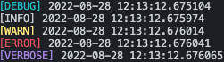

<a href="https://github.com/MamedenQ/function-burger/actions/workflows/unit-test.yml" target="_blank">
    
</a>
<a href="https://codecov.io/gh/MamedenQ/function-burger" >
    
</a>
<a href="https://codecov.io/gh/MamedenQ/function-burger" >
    
</a>
<a href="https://codecov.io/gh/MamedenQ/function-burger" >
    
</a>
<br>
<a href="https://pypi.org/project/function-burger" target="_blank">
    
</a>
<a href="https://pypi.org/project/function-burger" target="_blank">
    
</a>
<a href="https://pypi.org/project/function-burger" target="_blank">
    
</a>
<a href="https://github.com/MamedenQ/function-burger/blob/master/LICENSE" target="_blank">
    
</a>

# function-burger🍔 Overview

`function-burger`🍔 is a library that outputs logs before and(or) after a function.
Use it as a debugging tool.

example🍔 here!!<br>
<a href="https://colab.research.google.com/github/MamedenQ/function-burger/blob/master/example.ipynb" target="_blank">
    
</a>

# Installation

Install with pip:

```
pip install function-burger
```

# Usage

Simply specify the log output function as a decorator for the function you want to output logs.

- burger(burger_log)

Logs are output before and after the function.

```python
from function_burger import burger_log

@burger_log()
def example_func(input_str):
    print(f"input_str[{input_str}]")

example_func("example!!")
```

result:
```
[INFO] 2022-08-25 22:02:02.849391
input_str[example!!]
[INFO] 2022-08-25 22:02:02.852647
```

- top(top_log)

Output log before function.

```python
from function_burger import top_log

@top_log()
def example_func(input_str):
    print(f"input_str[{input_str}]")

example_func("example!!")
```

result:
```
[INFO] 2022-08-25 22:02:02.849391
input_str[example!!]
```

- bottom(bottom_log)

Logs are output after the function.

```python
from function_burger import bottom_log

@bottom_log()
def example_func(input_str):
    print(f"input_str[{input_str}]")

example_func("example!!")
```

result:
```
input_str[example!!]
[INFO] 2022-08-25 22:02:02.852647
```

# Options

Each option is described below.
The code example describes only the decorator portion and omits the logging function definition.

option table:

| option_name | burger_log | top_log | bottom_log |
|:-:|:-:|:-:|:-:|
| level  |  ○ | ○  |  ○ |
| timestamp  |  ○ | ○  |  ○ |
| elapsed_time  |  ○ |   |  ○ |
| fname  |  ○ | ○  |  ○ |
| tid  |  ○ | ○  |  ○ |
| inputval  |  ○ | ○  |   |
| inputval_func  |  ○ | ○  |   |
| retval  |  ○ |   |  ○ |
| retval_func  |  ○ |   |  ○ |
| top_word *1  |  ○ | ○  |   |
| bottom_word *2  |  ○ |   |  ○ |
| color  |  ○ | ○  |  ○ |

○:Available

*1 For `top_log`, specify `word`.
*2 For `bottom_log`, specify `word`.

## level

Specify the log level.

- `LogLevel.DEBUG`
- `LogLevel.INFO`(default)
- `LogLevel.WARN`
- `LogLevel.ERROR`
- `LogLevel.VERBOSE`

Each log level is color-coded.



example:
```python
@burger_log()
# [INFO] 2022-08-25 22:02:02.849391

@burger_log(level=LogLevel.WARN)
# [WARN] 2022-08-25 22:02:02.849391
```

## timestamp

Specify timestamp output.

- True(default)
- False

example:
```python
@burger_log()
# [INFO] 2022-08-25 22:02:02.849391

@burger_log(timestamp=False)
# [INFO]
```

## elapsed_time

Specify elapsed time output.

- True
- False(default)

example:
```python
@burger_log(elapsed_time=True)
# [INFO] 2022-08-25 22:02:02.849391 elapsed time[0:00:00.000010]
```

## fname

Specifies the output of the function name.

- True
- False(default)

example:
```python
@burger_log(fname=True)
# [INFO] 2022-08-25 22:02:02.849391 func[function_name]
```

## tid

Specifies the output of the thread ID.

- True
- False(default)

example:
```python
@burger_log(tid=True)
# [INFO] 2022-08-25 22:02:02.849391 [thread_id]
```

## inputval

Specifies the output of the input value.

- True
- False(default)

example:
```python
@burger_log(inputval=True)
def func(a: int, b: int, *, c: int, d: int):
    pass

func(1, 2, c=3, d=4)
# [INFO] 2022-08-25 22:02:02.849391 args[(1, 2)] keywords[{'c': 3, 'd': 4}]
```

## inputval_func

Specifies a function to edit the output format of input values.
Used when the input value is an object.

- None(default)
- function or lambda-expression

example:
```python
class ExampleCls:
    def __init__(self):
        self.num = 0
    def inc_num(self):
        self.num += 1
    def get_num(self):
        return self.num

@burger_log(
    inputval=True, inputval_func=lambda *a, **k: f"num[{a[0].get_num()}]"
)
def increment_num(cls):
    cls.inc_num()

cls = ExampleCls()
cls.inc_num()
cls.inc_num()
increment_num(cls)
# [INFO] 2022-08-25 22:02:02.849391 args[num[2]]
```

If `@burger_log(inputval=True)` is specified for the function:
```
[INFO] 2022-08-25 22:02:02.849391 args[(<__main__.ExampleCls object at 0x1046cd990>,)] keywords[{}]
```

## retval

Specifies the output of the return value.

- True
- False(default)

example:
```python
@burger_log(retval=True)
# [INFO] 2022-08-25 22:02:02.849391 ret[ret_val]
```

## retval_func

Specifies a function to edit the output format of the return value.
Used when the return value is an object.

- None(default)
- function or lambda-expression

example:
```python
class ExampleCls:
    def __init__(self):
        self.num = 0
    def inc_num(self):
        self.num += 1
    def get_num(self):
        return self.num

@burger_log(retval=True, retval_func=lambda a: f"num[{a.get_num()}]")
def get_example():
    return ExampleCls()

cls = get_example()
# [INFO] 2022-08-25 22:02:02.849391 ret[num[0]]
```

If `@burger_log(retval=True)` is specified for the function:
```
[INFO] 2022-08-25 22:02:02.849391 ret[<__main__.ExampleCls object at 0x105a1d810>]
```

## top_word

Specifies the string to be output to the log before the function call.

- ""(default)
- any character string

example:
```python
@burger_log(top_word="start")
# [INFO] 2022-08-25 22:02:02.849391 start
```

If `top_log`, specify `word` instead of `top_word`.

```python
@top_log(word="start")
# [INFO] 2022-08-25 22:02:02.849391 start
```

## bottom_word

Specifies the string to be output to the log after a function call.

- ""(default)
- any character string

example:
```python
@burger_log(bottom_word="end")
# [INFO] 2022-08-25 22:02:02.849491 end
```

If `bottom_log`, specify `word` instead of `bottom_word`.

```python
@bottom_log(word="end")
# [INFO] 2022-08-25 22:02:02.849391 end
```

## color

Specifies the text color of the log.

- `LogColor.VANILLA_SHAKE`(default)
- `LogColor.MUSTARD`
- `LogColor.KETCHUP`
- `LogColor.MINT_CHOCOLATE`
- `LogColor.SODA`
- `LogColor.LETTUCE`
- `LogColor.GRAPE_JUICE`
- `LogColor.COLA`


example:
```python
@burger_log(color=LogColor.KETCHUP)
# Output contents are omitted. See image above for colors.
```

# When an exception occurs

When an exception occurs, a message is forced to be displayed.

```python
@burger_log()
def example():
    raise Exception("An exception occurred.")

example()
```


# License

This project is licensed under the terms of the MIT license.
